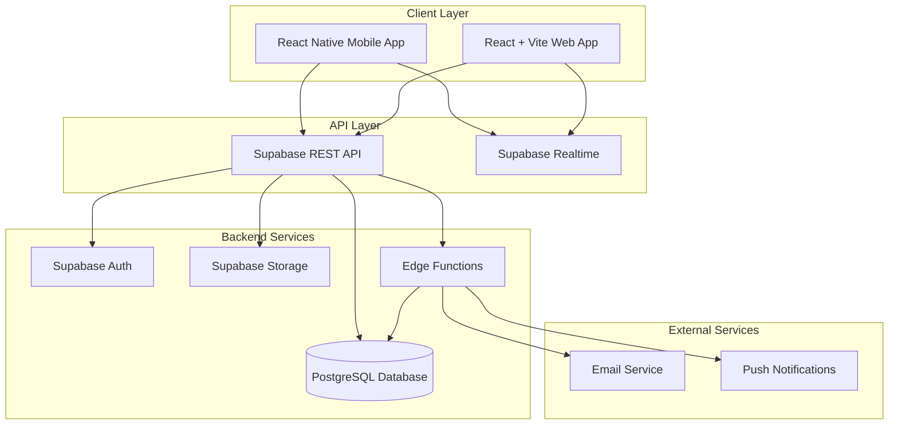

# Design Document - Classified Marketplace Platform

## Overview

The classified marketplace platform is a multi-platform system enabling users to post, browse, and manage classified advertisements. The architecture follows a modern client-server model with React Native mobile apps, React web application, and Supabase backend services. The design prioritizes rapid MVP development while maintaining a clear path for future AWS migration.

### Technology Stack

**Frontend:**
- Mobile: React Native (iOS & Android)
- Web: React 18+ with Vite bundler
- UI Components: shadcn/ui (web), React Native Paper (mobile)
- State Management: Zustand or React Query
- Routing: React Navigation (mobile), React Router (web)

**Backend:**
- Database: Supabase PostgreSQL
- Authentication: Supabase Auth
- Storage: Supabase Storage
- Real-time: Supabase Realtime subscriptions
- API: Supabase REST API and PostgREST

**Infrastructure:**
- Hosting: Vercel (web), Expo/EAS (mobile)
- CDN: Supabase CDN for images
- Analytics: Custom implementation with Supabase

## Architecture

### High-Level Architecture



### System Components

1. **Client Applications**: Native mobile and web interfaces
2. **API Gateway**: Supabase PostgREST auto-generated REST API
3. **Authentication Service**: Supabase Auth with JWT tokens
4. **Database Layer**: PostgreSQL with Row Level Security (RLS)
5. **Storage Service**: Object storage for images and media
6. **Real-time Service**: WebSocket connections for live updates
7. **Edge Functions**: Serverless functions for business logic

### Data Flow

**Listing Creation Flow:**
1. User submits listing form from client
2. Client uploads images to Supabase Storage
3. Client sends listing data with image URLs to API
4. Database trigger validates and stores listing
5. Real-time subscription notifies relevant clients
6. Analytics event recorded

**Search Flow:**
1. User enters search query
2. Client sends request to PostgREST with filters
3. Database executes full-text search query
4. Results returned with pagination
5. Client renders listing cards

## Components and Interfaces

### Frontend Components

#### Shared Component Library

**Core Components:**
- `ListingCard`: Display listing preview with image, title, price, location
- `ListingForm`: Multi-step form for creating/editing listings
- `ImageUploader`: Handle multiple image uploads with preview
- `SearchBar`: Search input with filters and suggestions
- `CategoryGrid`: Display browsable category tiles
- `UserAvatar`: User profile picture with fallback
- `MessageThread`: Chat interface for buyer-seller communication
- `AnalyticsChart`: Reusable chart components for metrics

#### Mobile App Structure

```
src/
├── screens/
│   ├── Home/
│   ├── Search/
│   ├── ListingDetail/
│   ├── CreateListing/
│   ├── Messages/
│   ├── Profile/
│   ├── Analytics/
│   └── Admin/
├── components/
│   ├── listings/
│   ├── navigation/
│   ├── forms/
│   └── shared/
├── services/
│   ├── supabase.ts
│   ├── auth.ts
│   ├── listings.ts
│   ├── analytics.ts
│   └── messaging.ts
├── hooks/
│   ├── useAuth.ts
│   ├── useListings.ts
│   └── useAnalytics.ts
├── stores/
│   └── authStore.ts
└── types/
    └── index.ts
```

#### Web App Structure

```
src/
├── pages/
│   ├── HomePage.tsx
│   ├── SearchPage.tsx
│   ├── ListingDetailPage.tsx
│   ├── CreateListingPage.tsx
│   ├── DashboardPage.tsx
│   ├── AdminPage.tsx
│   └── ProfilePage.tsx
├── components/
│   ├── ui/ (shadcn components)
│   ├── listings/
│   ├── layout/
│   └── forms/
├── lib/
│   ├── supabase.ts
│   ├── api/
│   └── utils/
├── hooks/
└── types/
```

### Backend Components

#### Database Schema

**Core Tables:**

```sql
-- Users (extended from Supabase auth.users)
CREATE TABLE profiles (
  id UUID PRIMARY KEY REFERENCES auth.users(id),
  username TEXT UNIQUE,
  full_name TEXT,
  phone TEXT,
  location TEXT,
  avatar_url TEXT,
  is_admin BOOLEAN DEFAULT false,
  is_suspended BOOLEAN DEFAULT false,
  created_at TIMESTAMPTZ DEFAULT NOW(),
  updated_at TIMESTAMPTZ DEFAULT NOW()
);

-- Categories
CREATE TABLE categories (
  id UUID PRIMARY KEY DEFAULT gen_random_uuid(),
  name TEXT NOT NULL,
  slug TEXT UNIQUE NOT NULL,
  icon TEXT,
  parent_id UUID REFERENCES categories(id),
  display_order INTEGER,
  created_at TIMESTAMPTZ DEFAULT NOW()
);

-- Listings
CREATE TABLE listings (
  id UUID PRIMARY KEY DEFAULT gen_random_uuid(),
  user_id UUID REFERENCES profiles(id) ON DELETE CASCADE,
  category_id UUID REFERENCES categories(id),
  title TEXT NOT NULL,
  description TEXT NOT NULL,
  price DECIMAL(10,2),
  currency TEXT DEFAULT 'UGX',
  location TEXT NOT NULL,
  condition TEXT CHECK (condition IN ('new', 'used', 'refurbished')),
  status TEXT DEFAULT 'active' CHECK (status IN ('draft', 'active', 'sold', 'expired', 'deleted')),
  moderation_status TEXT DEFAULT 'pending' CHECK (moderation_status IN ('pending', 'approved', 'rejected', 'flagged')),
  images TEXT[] DEFAULT '{}',
  contact_phone TEXT,
  contact_email TEXT,
  view_count INTEGER DEFAULT 0,
  contact_count INTEGER DEFAULT 0,
  created_at TIMESTAMPTZ DEFAULT NOW(),
  updated_at TIMESTAMPTZ DEFAULT NOW(),
  expires_at TIMESTAMPTZ DEFAULT NOW() + INTERVAL '30 days'
);

-- Create full-text search index
CREATE INDEX listings_search_idx ON listings 
USING GIN (to_tsvector('english', title || ' ' || description));

-- Saved Listings
CREATE TABLE saved_listings (
  id UUID PRIMARY KEY DEFAULT gen_random_uuid(),
  user_id UUID REFERENCES profiles(id) ON DELETE CASCADE,
  listing_id UUID REFERENCES listings(id) ON DELETE CASCADE,
  created_at TIMESTAMPTZ DEFAULT NOW(),
  UNIQUE(user_id, listing_id)
);

-- Messages
CREATE TABLE conversations (
  id UUID PRIMARY KEY DEFAULT gen_random_uuid(),
  listing_id UUID REFERENCES listings(id) ON DELETE CASCADE,
  buyer_id UUID REFERENCES profiles(id) ON DELETE CASCADE,
  seller_id UUID REFERENCES profiles(id) ON DELETE CASCADE,
  created_at TIMESTAMPTZ DEFAULT NOW(),
  updated_at TIMESTAMPTZ DEFAULT NOW(),
  UNIQUE(listing_id, buyer_id)
);

CREATE TABLE messages (
  id UUID PRIMARY KEY DEFAULT gen_random_uuid(),
  conversation_id UUID REFERENCES conversations(id) ON DELETE CASCADE,
  sender_id UUID REFERENCES profiles(id) ON DELETE CASCADE,
  content TEXT NOT NULL,
  is_read BOOLEAN DEFAULT false,
  created_at TIMESTAMPTZ DEFAULT NOW()
);

-- Analytics Events
CREATE TABLE analytics_events (
  id UUID PRIMARY KEY DEFAULT gen_random_uuid(),
  listing_id UUID REFERENCES listings(id) ON DELETE CASCADE,
  user_id UUID REFERENCES profiles(id) ON DELETE SET NULL,
  event_type TEXT NOT NULL CHECK (event_type IN ('view', 'contact', 'save', 'share')),
  metadata JSONB,
  created_at TIMESTAMPTZ DEFAULT NOW()
);

-- Moderation Queue
CREATE TABLE moderation_queue (
  id UUID PRIMARY KEY DEFAULT gen_random_uuid(),
  listing_id UUID REFERENCES listings(id) ON DELETE CASCADE,
  reason TEXT NOT NULL,
  flagged_by UUID REFERENCES profiles(id),
  reviewed_by UUID REFERENCES profiles(id),
  reviewed_at TIMESTAMPTZ,
  action_taken TEXT CHECK (action_taken IN ('approved', 'rejected', 'deleted')),
  admin_notes TEXT,
  created_at TIMESTAMPTZ DEFAULT NOW()
);
```

#### Row Level Security (RLS) Policies

```sql
-- Profiles: Users can read all, update own
ALTER TABLE profiles ENABLE ROW LEVEL SECURITY;

CREATE POLICY "Public profiles are viewable by everyone"
  ON profiles FOR SELECT
  USING (true);

CREATE POLICY "Users can update own profile"
  ON profiles FOR UPDATE
  USING (auth.uid() = id);

-- Listings: Public read for active, users manage own
ALTER TABLE listings ENABLE ROW LEVEL SECURITY;

CREATE POLICY "Active listings are viewable by everyone"
  ON listings FOR SELECT
  USING (status = 'active' AND moderation_status = 'approved');

CREATE POLICY "Users can insert own listings"
  ON listings FOR INSERT
  WITH CHECK (auth.uid() = user_id);

CREATE POLICY "Users can update own listings"
  ON listings FOR UPDATE
  USING (auth.uid() = user_id);

CREATE POLICY "Admins can view all listings"
  ON listings FOR SELECT
  USING (
    EXISTS (
      SELECT 1 FROM profiles
      WHERE profiles.id = auth.uid()
      AND profiles.is_admin = true
    )
  );

-- Similar policies for other tables...
```

### API Interfaces

#### Supabase Client Service

```typescript
// lib/supabase.ts
import { createClient } from '@supabase/supabase-js';
import type { Database } from './types/database';

export const supabase = createClient<Database>(
  process.env.SUPABASE_URL!,
  process.env.SUPABASE_ANON_KEY!
);

// Type-safe database types
export type Listing = Database['public']['Tables']['listings']['Row'];
export type Profile = Database['public']['Tables']['profiles']['Row'];
export type Category = Database['public']['Tables']['categories']['Row'];
```

#### Listing Service Interface

```typescript
// services/listings.ts
export interface ListingService {
  // Create
  createListing(data: CreateListingInput): Promise<Listing>;
  uploadImages(files: File[]): Promise<string[]>;
  
  // Read
  getListings(filters: ListingFilters): Promise<PaginatedListings>;
  getListingById(id: string): Promise<Listing>;
  searchListings(query: string, filters: SearchFilters): Promise<Listing[]>;
  getUserListings(userId: string): Promise<Listing[]>;
  
  // Update
  updateListing(id: string, data: UpdateListingInput): Promise<Listing>;
  incrementViewCount(id: string): Promise<void>;
  incrementContactCount(id: string): Promise<void>;
  
  // Delete
  deleteListing(id: string): Promise<void>;
}

export interface CreateListingInput {
  title: string;
  description: string;
  price: number;
  categoryId: string;
  location: string;
  condition: 'new' | 'used' | 'refurbished';
  images: string[];
  contactPhone?: string;
  contactEmail?: string;
}

export interface ListingFilters {
  categoryId?: string;
  minPrice?: number;
  maxPrice?: number;
  location?: string;
  condition?: string;
  page: number;
  limit: number;
}
```

#### Analytics Service Interface

```typescript
// services/analytics.ts
export interface AnalyticsService {
  // Track events
  trackView(listingId: string, userId?: string): Promise<void>;
  trackContact(listingId: string, userId?: string): Promise<void>;
  trackSave(listingId: string, userId: string): Promise<void>;
  
  // Get metrics
  getListingAnalytics(listingId: string, days: number): Promise<ListingAnalytics>;
  getUserAnalytics(userId: string, days: number): Promise<UserAnalytics>;
  getPlatformAnalytics(days: number): Promise<PlatformAnalytics>;
}

export interface ListingAnalytics {
  listingId: string;
  views: number;
  contacts: number;
  saves: number;
  conversionRate: number;
  dailyViews: DailyMetric[];
}

export interface UserAnalytics {
  totalListings: number;
  activeListings: number;
  totalViews: number;
  totalContacts: number;
  averageViewsPerListing: number;
  topPerformingListings: Listing[];
}
```

#### Admin Service Interface

```typescript
// services/admin.ts
export interface AdminService {
  // Moderation
  getModerationQueue(): Promise<ModerationItem[]>;
  approveListing(listingId: string, adminNotes?: string): Promise<void>;
  rejectListing(listingId: string, reason: string): Promise<void>;
  deleteListing(listingId: string, reason: string): Promise<void>;
  
  // User management
  getUsers(filters: UserFilters): Promise<PaginatedUsers>;
  suspendUser(userId: string, reason: string): Promise<void>;
  activateUser(userId: string): Promise<void>;
  deleteUser(userId: string): Promise<void>;
  
  // Platform stats
  getPlatformStats(): Promise<PlatformStats>;
}

export interface PlatformStats {
  totalUsers: number;
  activeUsers: number;
  totalListings: number;
  activeListings: number;
  pendingModeration: number;
  dailyActiveUsers: number;
  dailyNewListings: number;
}
```

## Data Models

### Core Domain Models

```typescript
// types/index.ts

export interface User {
  id: string;
  username: string;
  fullName: string;
  email: string;
  phone?: string;
  location?: string;
  avatarUrl?: string;
  isAdmin: boolean;
  isSuspended: boolean;
  createdAt: string;
  updatedAt: string;
}

export interface Listing {
  id: string;
  userId: string;
  categoryId: string;
  title: string;
  description: string;
  price: number;
  currency: string;
  location: string;
  condition: 'new' | 'used' | 'refurbished';
  status: 'draft' | 'active' | 'sold' | 'expired' | 'deleted';
  moderationStatus: 'pending' | 'approved' | 'rejected' | 'flagged';
  images: string[];
  contactPhone?: string;
  contactEmail?: string;
  viewCount: number;
  contactCount: number;
  createdAt: string;
  updatedAt: string;
  expiresAt: string;
  
  // Populated relations
  user?: User;
  category?: Category;
}

export interface Category {
  id: string;
  name: string;
  slug: string;
  icon?: string;
  parentId?: string;
  displayOrder: number;
  createdAt: string;
  
  // Populated relations
  subcategories?: Category[];
}

export interface Message {
  id: string;
  conversationId: string;
  senderId: string;
  content: string;
  isRead: boolean;
  createdAt: string;
  
  // Populated relations
  sender?: User;
}

export interface Conversation {
  id: string;
  listingId: string;
  buyerId: string;
  sellerId: string;
  createdAt: string;
  updatedAt: string;
  
  // Populated relations
  listing?: Listing;
  buyer?: User;
  seller?: User;
  messages?: Message[];
  lastMessage?: Message;
}
```

### State Management Models

```typescript
// stores/authStore.ts (Zustand example)
export interface AuthState {
  user: User | null;
  session: Session | null;
  isLoading: boolean;
  isAuthenticated: boolean;
  
  // Actions
  signIn: (email: string, password: string) => Promise<void>;
  signUp: (email: string, password: string, profile: Partial<User>) => Promise<void>;
  signOut: () => Promise<void>;
  updateProfile: (data: Partial<User>) => Promise<void>;
}
```

## Error Handling

### Error Types

```typescript
export class AppError extends Error {
  constructor(
    public code: string,
    public message: string,
    public statusCode: number = 500,
    public details?: any
  ) {
    super(message);
    this.name = 'AppError';
  }
}

export class AuthenticationError extends AppError {
  constructor(message: string = 'Authentication failed') {
    super('AUTH_ERROR', message, 401);
  }
}

export class ValidationError extends AppError {
  constructor(message: string, details?: any) {
    super('VALIDATION_ERROR', message, 400, details);
  }
}

export class NotFoundError extends AppError {
  constructor(resource: string) {
    super('NOT_FOUND', `${resource} not found`, 404);
  }
}

export class PermissionError extends AppError {
  constructor(message: string = 'Permission denied') {
    super('PERMISSION_ERROR', message, 403);
  }
}
```

### Error Handling Strategy

**Client-Side:**
1. Global error boundary for React components
2. API error interceptor for consistent handling
3. User-friendly error messages with retry options
4. Offline detection and queue management
5. Sentry integration for error tracking

**Backend:**
1. Database constraint violations mapped to validation errors
2. RLS policy violations return 403 Forbidden
3. Edge function errors logged and returned with safe messages
4. Rate limiting for API endpoints
5. Automated alerts for critical errors

### Error Response Format

```typescript
export interface ErrorResponse {
  error: {
    code: string;
    message: string;
    details?: any;
    timestamp: string;
    requestId?: string;
  };
}
```

## Testing Strategy

### Testing Pyramid

**Unit Tests (60%):**
- Service functions and business logic
- Utility functions and helpers
- Component logic (hooks, state management)
- Data transformations and validators

**Integration Tests (30%):**
- API endpoint interactions
- Database operations with test data
- Authentication flows
- File upload workflows

**E2E Tests (10%):**
- Critical user journeys (create listing, search, contact seller)
- Admin moderation workflows
- Cross-platform authentication

### Testing Tools

**Frontend:**
- Jest + React Testing Library (web)
- Jest + React Native Testing Library (mobile)
- Playwright for E2E tests (web)
- Detox for E2E tests (mobile)

**Backend:**
- Supabase local development environment
- pgTAP for database tests
- Postman/Newman for API tests

### Test Data Strategy

1. Use Supabase seed scripts for consistent test data
2. Factory functions for generating test entities
3. Separate test database for integration tests
4. Mock Supabase client for unit tests
5. Cleanup scripts to reset test state

### CI/CD Testing

```yaml
# Example GitHub Actions workflow
name: Test Suite
on: [push, pull_request]

jobs:
  test:
    runs-on: ubuntu-latest
    steps:
      - uses: actions/checkout@v3
      - name: Setup Node
        uses: actions/setup-node@v3
      - name: Install dependencies
        run: npm ci
      - name: Run unit tests
        run: npm run test:unit
      - name: Run integration tests
        run: npm run test:integration
      - name: Run E2E tests
        run: npm run test:e2e
```

## Performance Considerations

### Frontend Optimization

1. **Image Optimization:**
   - Lazy loading for listing images
   - Responsive images with multiple sizes
   - WebP format with fallbacks
   - CDN caching via Supabase Storage

2. **Code Splitting:**
   - Route-based code splitting
   - Lazy load admin panel
   - Dynamic imports for heavy components

3. **Data Fetching:**
   - React Query for caching and deduplication
   - Pagination for listing results
   - Infinite scroll with virtual scrolling
   - Optimistic updates for better UX

4. **Mobile Performance:**
   - FlatList with optimized rendering
   - Image caching with react-native-fast-image
   - Minimize bridge calls
   - Use Hermes engine for Android

### Backend Optimization

1. **Database:**
   - Indexes on frequently queried columns
   - Materialized views for analytics
   - Connection pooling via Supabase
   - Query optimization with EXPLAIN ANALYZE

2. **Caching:**
   - Browser caching for static assets
   - API response caching where appropriate
   - Real-time subscription for live updates

3. **Storage:**
   - Image compression before upload
   - CDN for global distribution
   - Automatic thumbnail generation

## Security Considerations

### Authentication & Authorization

1. JWT tokens with short expiration
2. Refresh token rotation
3. Row Level Security for all tables
4. Admin role verification for sensitive operations
5. Rate limiting on auth endpoints

### Data Protection

1. Input validation and sanitization
2. SQL injection prevention via parameterized queries
3. XSS protection with content security policy
4. HTTPS only for all communications
5. Secure file upload validation

### Privacy

1. Email verification required
2. Phone number masking in listings
3. GDPR-compliant data deletion
4. User consent for analytics tracking
5. Secure message encryption

## Migration Path to AWS

### Phase 1: Preparation (Current)

- Abstract database access behind service layer
- Use environment variables for all config
- Document Supabase-specific features used
- Implement feature flags for gradual migration

### Phase 2: Parallel Infrastructure

- Set up AWS RDS PostgreSQL
- Configure AWS S3 for storage
- Implement AWS Cognito for auth
- Deploy API Gateway + Lambda functions

### Phase 3: Data Migration

- Export data from Supabase
- Import to AWS RDS
- Migrate files to S3
- Update CDN configuration

### Phase 4: Cutover

- Update client apps with new endpoints
- Monitor both systems during transition
- Gradual traffic shift using feature flags
- Decommission Supabase after validation

### Abstraction Layer Example

```typescript
// lib/database/interface.ts
export interface DatabaseProvider {
  query<T>(sql: string, params: any[]): Promise<T[]>;
  insert<T>(table: string, data: any): Promise<T>;
  update<T>(table: string, id: string, data: any): Promise<T>;
  delete(table: string, id: string): Promise<void>;
}

// lib/database/supabase-provider.ts
export class SupabaseProvider implements DatabaseProvider {
  // Supabase implementation
}

// lib/database/aws-provider.ts (future)
export class AWSProvider implements DatabaseProvider {
  // AWS implementation
}

// lib/database/index.ts
export const db: DatabaseProvider = 
  process.env.DB_PROVIDER === 'aws' 
    ? new AWSProvider() 
    : new SupabaseProvider();
```

## Deployment Strategy

### Development Environment

- Local Supabase instance via Docker
- Expo Go for mobile development
- Vite dev server for web
- Hot reload enabled

### Staging Environment

- Supabase staging project
- Vercel preview deployments (web)
- Expo EAS preview builds (mobile)
- Automated deployments on PR

### Production Environment

- Supabase production project
- Vercel production (web)
- App Store + Google Play (mobile)
- Automated deployments on main branch merge
- Blue-green deployment strategy

## Monitoring and Observability

### Metrics to Track

1. **Application Metrics:**
   - API response times
   - Error rates
   - User session duration
   - Feature usage statistics

2. **Business Metrics:**
   - Daily active users
   - Listings created per day
   - Search queries per day
   - Conversion rates (view to contact)

3. **Infrastructure Metrics:**
   - Database query performance
   - Storage usage
   - API rate limits
   - CDN cache hit rates

### Tools

- Supabase Dashboard for database metrics
- Vercel Analytics for web performance
- Sentry for error tracking
- Custom analytics dashboard for business metrics
- LogRocket for session replay (optional)
